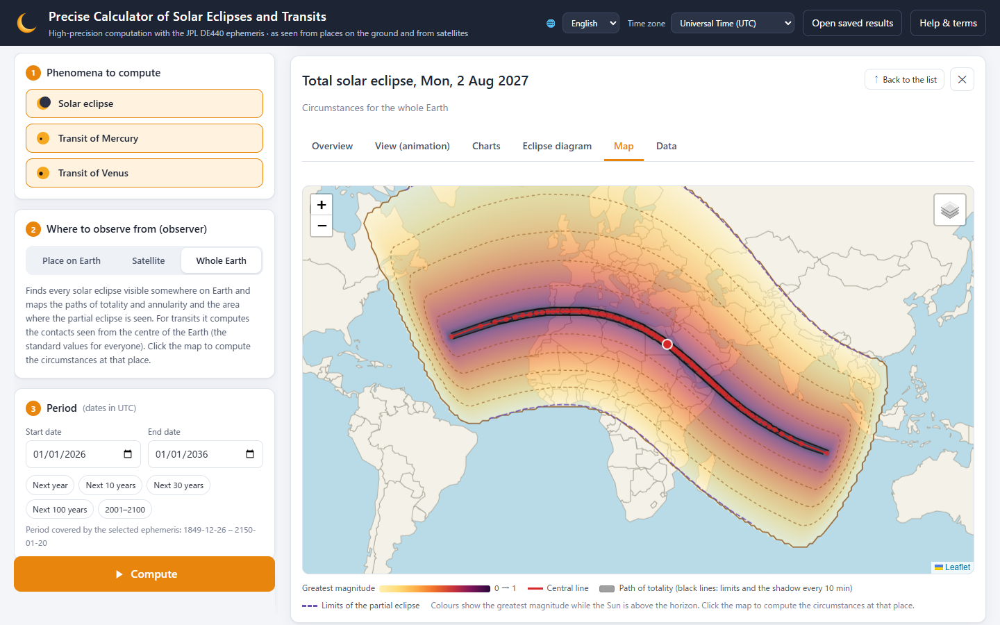
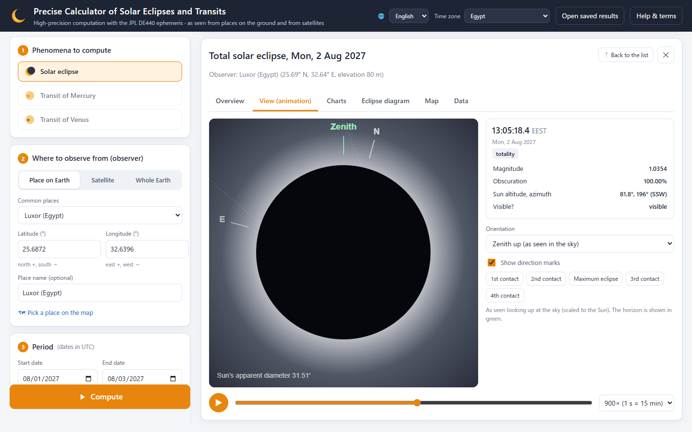
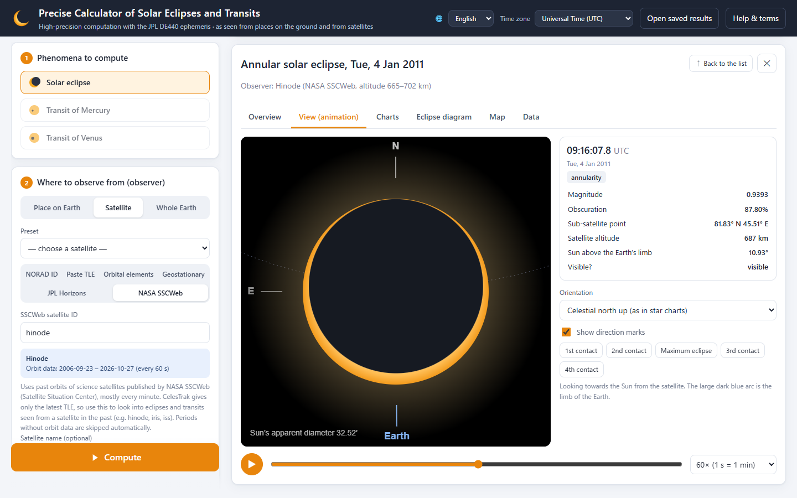
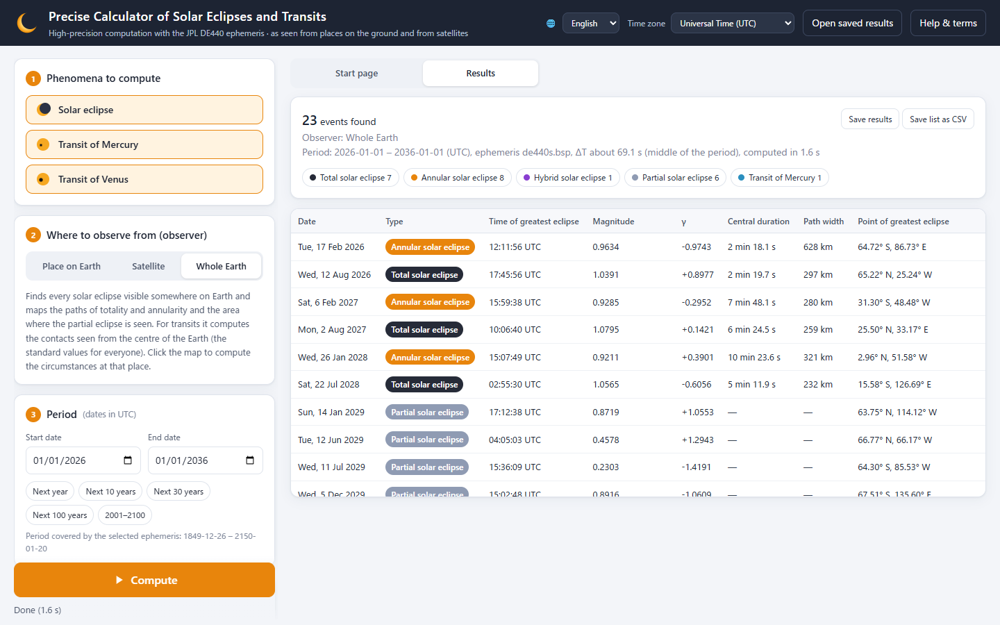
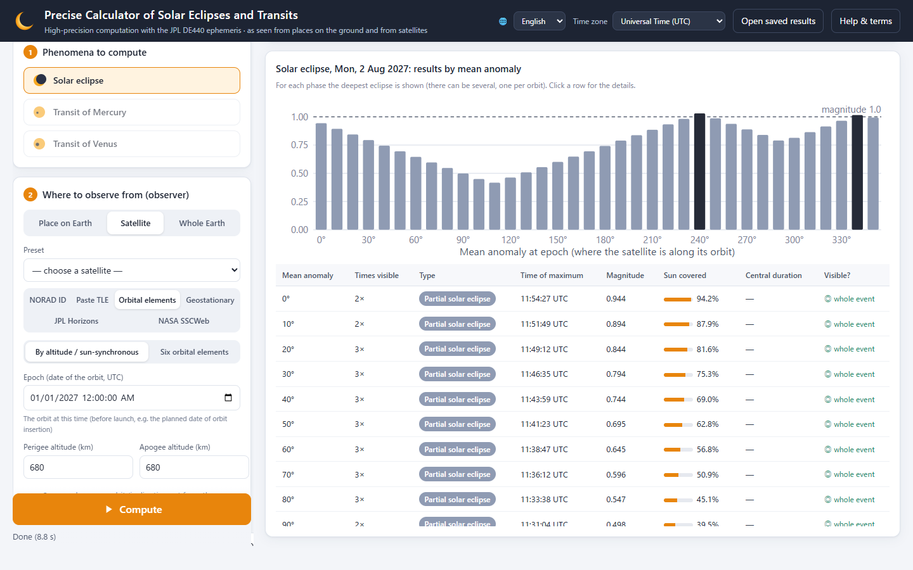

# Precise Calculator of Solar Eclipses and Transits

**English** | [日本語](README.ja.md)

A tool that computes solar eclipses (the Sun eclipsed by the Moon) and transits of Mercury and Venus with high precision, and shows them clearly in your browser.
The observer can be **any place on the ground**, **an artificial satellite (TLE / orbital elements / geostationary satellite / any spacecraft in JPL Horizons)**, or **the whole Earth**.



| | |
|---|---|
|  |  |
| **Seen from the ground**: the total solar eclipse of 2 August 2027 at Luxor (Egypt). Totality lasts 6 min 22.6 s, and the progress of the eclipse can be played as an animation | **Seen from a satellite**: the annular eclipse that the solar observatory Hinode saw in orbit on 4 January 2011 |
|  |  |
| **List**: the solar eclipses and transits in the world from 2026 to 2035 (type, magnitude, duration of the central eclipse, Saros number) | **Planning before launch**: the eclipse of 2 August 2027 seen from a 680 km sun-synchronous orbit, computed for each position of the satellite (mean anomaly) |

## Getting started

You can use it without installing Python.

### Distribution packages (nothing else to download)

| OS | File | Contents |
|---|---|---|
| Windows 10 / 11 | `solar_eclipse_calc-<version>-windows-x64.zip` (about 66 MB) | A folder (start it with `start.bat`) |
| macOS 11 or later (Apple silicon and Intel) | `solar_eclipse_calc-<version>-macos.zip` (about 120 MB) | The app "日食計算機" (Eclipse Calculator) |

Python, the libraries and the JPL ephemeris (1849–2150) are included, so it starts in a few seconds without an internet connection, even the first time.
`http://127.0.0.1:8765/` opens in your browser (if the port is in use, it opens the copy of this tool that is already running, or picks a free port automatically).
It does not touch your PC's settings or any Python you have installed, and it needs no administrator rights.

The calculator's screen and messages are in English if your browser is set to English (you can switch the language with 🌐 at the top right).

**Windows**

1. Right-click the ZIP → "Extract All", then double-click `start.bat` in the extracted folder.
2. If "Windows protected your PC" appears the first time, click "More info" → "Run anyway".
3. To quit, close all the calculator's pages (tabs) in the browser. About 10 seconds later, the black window (Command Prompt) that opened at start-up closes by itself. Closing the black window also quits. When you no longer need it, delete the whole folder.

**Mac**

1. Download the ZIP with a browser such as Safari, double-click it to extract it, and drag "日食計算機" to the "Applications" folder.
2. Double-click "日食計算機". The first time, macOS asks whether you are sure you want to open an app downloaded from the internet; click "Open".
3. To quit, close the calculator's tab (or the browser), or click "Quit" at the top right of the page. When all its tabs are closed, the calculator also quits by itself after about 10 seconds.

If you save the ZIP to the Mac from the Remote Desktop app "Windows App", a messaging app or the like, macOS blocks the app and says that the application "日食計算機" can't be opened. Download it again with a browser.

Ephemerides you add are saved in `~/Library/Application Support/SolarEclipseCalc`, and the log in `~/Library/Logs/SolarEclipseCalc.log`. When you no longer need them, delete the app and this folder.
The Mac version is signed with an Apple Developer ID and notarized for distribution ([how it is built](docs/macos_signing.md), in Japanese). A Mac version that is not notarized shows '"日食計算機" Not Opened' the first time; then open it with "Open Anyway" under "System Settings" → "Privacy & Security".

To cover 1550–2650, click **"Add de440.bsp"** in "Advanced settings" on the page. It downloads DE440 (about 114 MB), which you can then select as the ephemeris.
On Windows, when you move to a new version, you can skip the download by moving the added ephemeris (`data/de440.bsp`) into `data/` of the new folder (on a Mac it carries over as it is).

### Starting from the source

A folder that is not a distribution package, such as a ZIP of the repository, can also be started with `start.bat` (Windows) / `start.command` (macOS; on Linux run `sh start.command` in a terminal).
In that case the first start downloads a Python runtime ([uv](https://github.com/astral-sh/uv) and Python 3.12), the libraries and the JPL ephemeris from the internet, which takes a few minutes. After that it starts in a few seconds and works offline.
Python and the libraries are placed only in `.runtime/` inside the folder (about 200 MB).

On a Mac, double-clicking `start.command` in a downloaded copy of the source says that it is damaged and can't be opened (because the script is not signed). The first time only, open "Terminal", type `sh ` (sh followed by a space), drag `start.command` into the Terminal window and press return. This removes the "downloaded from the internet" mark from the folder, so from then on you can start it with a double-click.

### If you use Python

```bash
pip install -r requirements.txt
python run.py
```

DE440 can also be added with `python tools/download_ephemeris.py de440`.
You can also run the tests and tools with the Python prepared by `start.bat` / `start.command` (`.runtime/venv/`), e.g. `.runtime\venv\Scripts\python tests\test_validation.py` on Windows and `.runtime/venv/bin/python tests/test_validation.py` on Mac and Linux.

### Computing from the command line (for generative AI)

`cli.py` runs the same computations as the page, without opening it. The observer can be any of the following, as on the page.
If you give orbit information and the like to a generative AI (a coding agent such as Claude Code), the AI can compute and check it with `cli.py`: the steps and the output fields are in [docs/cli.md](docs/cli.md) (in Japanese), and the key points for AI agents in [AGENTS.md](AGENTS.md).

| Observer | Arguments |
|---|---|
| Six orbital elements | `--epoch` (epoch, UTC) `--a --e --i --raan --argp --m` |
| Planned orbit | `--epoch` and `--alt` (or `--perigee-alt --apogee-alt`), `--sso` (or `--i`), `--ltan` (or `--raan`). `--sweep 10` computes for each mean anomaly |
| TLE | `--tle FILE` (`-` for standard input), `--norad NUMBER` (fetches the latest TLE from CelesTrak). For events weeks after the epoch, check the spread due to the satellite's position with `--sweep 10` |
| Geostationary satellites, spacecraft, past orbits | `--geo-lon LONGITUDE`, `--horizons ID` (JPL Horizons), `--sscweb ID` (NASA SSCWeb) |
| A place on the ground, the whole Earth | `--lat --lon --elev`, `--city NAME`, `--global` |
| JSON | `--request FILE` (the same form as the Web API) |

```bash
python cli.py --epoch 2027-07-30T12:00:00 --a 7058.1 --e 0.0012 --i 98.13 --raan 220.5 --argp 90 --m 45 --start 2027-07-25 --end 2027-08-10 --lang en
```

```bash
python cli.py --city Tokyo --start 2026-01-01 --end 2056-01-01 --phenomena moon --tz 9 --detail --lang en
```

The period is given by `--start` `--end` (dates in UTC), and the phenomena by `--phenomena` (`moon`, `mercury`, `venus`; all by default).
The output is `--format table` (the default; `--tz 9` shows Japan time), `csv` (the same columns as "Save list as CSV" on the page) or `json` (with the computation settings `request`; meant for generative AI). `--detail` also outputs the time, Sun altitude, position angle and so on of each contact. `--dry-run` computes nothing and outputs only how the input was interpreted (the satellite's period, altitude and so on).
The language is chosen with `--lang` (`ja`, `en`, `fr`, `ru`, `es`, `zh`, `hi`; by default the language of the environment).
See `python cli.py --help` for the other arguments.
Without Python installed, use `.runtime\python-windows-x86_64\python.exe -E -s cli.py …` in the Windows distribution package, or the Python in `.runtime/venv/` if you prepared the source with `start.bat` / `start.command`.
Output to files and pipes is UTF-8. If the output is garbled when Windows PowerShell 5.1 receives it, save it with `-o FILE`.

### Building the distribution packages

```bash
python tools/build_bundles.py
```

This makes ZIPs for Windows and macOS in `dist/` (a few minutes; the Mac one can be built on Windows too). It needs [uv](https://github.com/astral-sh/uv) and git.
They contain the files tracked by git (those already `git add`ed), `data/de440s.bsp`, Python 3.12 ([python-build-standalone](https://github.com/astral-sh/python-build-standalone); the version and checksums are fixed in the script) and the libraries satisfying `requirements.txt` at the time of building.
The libraries' bytecode is compiled in advance, so even the first start is fast. A Linux package can be built with `--target linux-x86_64`.

To sign the Mac version with a Developer ID and notarize it, give a settings file to `--sign`. [docs/macos_signing.md](docs/macos_signing.md) (in Japanese) goes through it step by step, starting from preparing the certificate and the API key.

```bash
python tools/build_bundles.py --target macos --sign <signing folder>/signing.json
```

## What it can do

| Observer | Details |
|---|---|
| A place on the ground | Latitude, longitude and elevation (WGS84). City presets, picking a place by clicking a map. Takes the horizon, atmospheric refraction and a minimum Sun altitude into account |
| Artificial satellite | Latest TLE fetched from CelesTrak by NORAD number (SGP4) / pasted TLE / Keplerian orbital elements (with J2 secular perturbations; besides entering the six orbital elements directly [epoch, semi-major axis, eccentricity, inclination, right ascension of the ascending node, argument of perigee, mean anomaly], an orbit can be given by its altitude, with the inclination of a sun-synchronous orbit computed automatically, and by the local time of the ascending node) / ideal geostationary satellite / any spacecraft in JPL Horizons (JWST, SOHO, etc.) / past orbits of science satellites from NASA SSCWeb (Hinode etc.; for reproducing past events). Takes into account **the Sun being hidden by the Earth** (the height of the atmosphere can also be given) |
| The whole Earth | Finds every solar eclipse seen anywhere in the world (type, γ, magnitude, point of greatest eclipse, duration of the central eclipse, width of the central path, Saros number). Transits are given with geocentric contact times |

The results (switch between the start page and the results with "Start page" / "Results" at the top; "↑ Back to the list" in the details returns to the list):

- **List**: date, type, time of maximum, magnitude / distance between centres, duration, visibility (eclipse in progress at sunrise or sunset, hidden by the Earth) and Saros. Filter by type, save as CSV. **"Save results" saves the list and the settings, and "Open saved results" at the top right shows them again later on the same page** (the list is shown as it was saved; clicking a row recomputes the details, animation and map with the saved settings. The output of `cli.py --format json` can be opened too)
- **Overview**: a description in plain language, the key values, and for the 1st to 4th contacts the time, Sun altitude/azimuth, position angle P / vertex angle V and the sub-satellite point
- **View (animation)**: plays the discs of the Sun and the Moon or planet at true scale (zenith up / celestial north up / Earth down). Also shows the horizon, the limb of the Earth seen from a satellite and the corona during totality
- **Charts**: magnitude and obscuration (for transits, the distance between centres), and the Sun's altitude or its "angle above the Earth's limb"
- **Eclipse diagram**: one figure with the path of the Moon or planet across the Sun, the discs at the 1st contact, maximum and 4th contact, the times and positions of the contacts (in arcseconds from the centre of the Sun) and the key values (celestial north up / the Sun's rotation axis north up; saved as PNG or SVG)
- **Map**: central line, northern and southern limits of the path of totality or annularity, the umbra every 10 minutes, limits of the partial eclipse, distribution of the greatest magnitude (only while the Sun is above the horizon), the region where a transit is visible, and the satellite's ground track. **Click the map to compute the circumstances at that place**
- **Data**: JSON (can be opened again with "Open saved results"), time-series CSV, text

The time zone of the displayed times can be switched at the top right (computations are done in UTC/TT; only the display is converted).

The language of the page is chosen with 🌐 at the top right, from 日本語, English, Français, Русский, Español, 中文 and हिन्दी (the first time it follows the browser's language, and the chosen language is used next time too). Error and warning messages are also shown in the chosen language. The output of `cli.py` can be in the same languages with `--lang`. The other documents (in `docs/`) are in Japanese.

### Satellites before launch

The dates of solar eclipses are known years in advance, but the times and the depth of an eclipse seen from a satellite depend strongly on "where the satellite is in its orbit at that moment", which is not known until the satellite is launched and its orbit is fixed.
Enter the planned values in "Orbital elements" (the altitude and, for a sun-synchronous orbit, the local time of the ascending node) and select **"Compute for many mean anomalies (planning before launch)"**. The satellite's position is varied in steps of 5–45°, and for each event the following ranges are summarised:

- whether it is seen from the satellite, and how many times the satellite meets one eclipse (in low orbits it meets it again on each orbit)
- the range of the greatest magnitude, and the share of phases with a total or annular eclipse
- the range of the time of maximum (from the table and chart of the results by phase, the details of each case can be opened too)

Example: the total solar eclipse of 2027-08-02 seen from a 680 km sun-synchronous orbit with the ascending node at 18:00 is a partial eclipse met 2–3 times for every phase, but the greatest magnitude varies widely with the phase, from 0.42 to 1.03, and only 2 of the 36 cases are total.
After launch, fetch the latest TLE by NORAD number and compute again; computing once more a few days before the event gives times to the second (in [the validation with Hinode](docs/hinode_validation.md) (in Japanese), the difference was 5–20 s with orbital elements from 3–4 weeks before, and about 1 s with the orbit just before the event).

## Accuracy and validation

Comparison with the values published by NASA (Espenak & Meeus); reproducible with `python tests/test_validation.py`.
For the contact times the same radii as NASA are used (Sun 959.63″, Venus 8.41″ and Mercury 3.36″ at 1 AU).

| Phenomenon | Item | NASA | This tool |
|---|---|---|---|
| 2012 transit of Venus (geocentric) | 1st–4th contacts | 22:09:38 / 22:27:34 / 01:29:36 / 04:31:39 / 04:49:35 | 22:09:37.5 / 22:27:34.0 / 01:29:36.7 / 04:31:39.1 / 04:49:35.7 |
| 2004 transit of Venus (geocentric) | 1st–4th contacts | 05:13:29 / 05:32:55 / 08:19:44 / 11:06:33 / 11:25:59 | 05:13:30.0 / 05:32:55.8 / 08:19:44.7 / 11:06:33.4 / 11:25:59.3 |
| 2019 transit of Mercury (geocentric) | 1st–4th contacts, least distance | 12:35:27 / 12:37:08 / 15:19:48 / 18:02:33 / 18:04:14, 75.9″ | 12:35:27.2 / 12:37:08.4 / 15:19:48.1 / 18:02:33.0 / 18:04:14.3, 75.9″ |
| 2017-08-21 total solar eclipse | γ, magnitude, duration, width | 0.4367, 1.0306, 2 min 40 s, 115 km | 0.4367, 1.0306, 2 min 40.0 s, 114.7 km |
| 2024-04-08 total solar eclipse | γ, magnitude, duration, width | 0.3431, 1.0566, 4 min 28 s, 197.5 km | 0.3431, 1.0566, 4 min 28.0 s, 197.5 km |
| 2023-04-20 hybrid solar eclipse | magnitude, duration | 1.0132, 1 min 16 s | 1.0132, 1 min 16.0 s |
| 2023-10-14 annular solar eclipse | magnitude, duration | 0.9520, 5 min 17 s | 0.9520, 5 min 17.1 s |
| Solar eclipses of 2001–2100 | count | partial 77, annular 72, total 68, hybrid 7 | same |

In addition, the limits of the path of totality obtained with the "shadow cone" model used for the map are checked with independent computations for single places (apparent positions for an observer on the ground with Skyfield): 100 m outside a limit the eclipse is partial, and 100 m inside it is total.

### Comparison with observations by the solar observatory Hinode

The solar eclipses and transits that Hinode (altitude about 680 km) met in orbit in 2006–2017 were computed from its past orbit in NASA SSCWeb and checked against the actual images and the predictions of the National Astronomical Observatory of Japan (`python tests/test_hinode.py`; the images are measured with `python tools/validate_hinode_images.py`. Details in [docs/hinode_validation.md](docs/hinode_validation.md), in Japanese).

| Compared with | Result |
|---|---|
| Position of the Moon in X-ray telescope images (2014, 2016, 2017) | 0.4–3.5 s from the actual event (equivalent to an along-track error of 3–28 km in the orbit). The rotation of the images agrees with the position angle of the Sun's rotation axis within 0.4° |
| Predictions by the National Astronomical Observatory of Japan (Mitsuru Sôma) for 8 events, 20 passes | An almost constant offset for each event (from the different orbital elements). With it removed, the residuals are 0.2–0.65 s RMS |
| Observation reports of 11 events (magnitude, image times, eclipses that happened only in orbit, the 1st contact of Venus falling in the Earth's shadow, etc.) | All consistent |

The accuracy of eclipses computed for a satellite in low orbit is set almost entirely by the accuracy of the satellite's orbit (7.5 km along track ≈ 1 s).

### How it computes

- **Positions of bodies**: JPL DE440/DE440s (Skyfield). The light time is iterated for each observer (converged to 10⁻¹² day)
- **Time scales**: ΔT from IERS observations and a long-term model (can also be set by hand), UTC including leap seconds
- **Contacts**: from the apparent radii of the Sun and the Moon (planet) and the angular distance between their centres as seen by the observer. Aberration acts on all directions as a conformal map and does not change contacts (the tangency of circles), so contacts are found from BCRS directions (positions of the bodies), and altitude, azimuth and position angles are computed from apparent positions
- **Search**: candidate windows are narrowed down with the geocentric conjunctions (new Moon, inferior conjunction), and the window width is set from the observer's largest parallax. A branch-and-bound scan with a Lipschitz constant from the actual angular velocities of both bodies makes sure that short eclipses (a few minutes for a satellite in low orbit) are not missed. Contacts are converged to 0.1 ms by bisection, and the maximum by golden-section search
- **Eclipses over the whole Earth**: the geocentric apparent positions of the Sun and the Moon are converted to ITRS (Earth-fixed coordinates), and the intersections of the penumbral and umbral cones tangent to the Sun and the Moon with the WGS84 ellipsoid are computed directly (equivalent to Besselian elements). The limit lines are found as envelopes of the shadow outlines (the points on the outline where the time derivative of the boundary is zero)
- **Radius of the Moon**: the NASA convention (k = 0.2725076 for external contacts, k = 0.272281 for internal ones) approximates the average effect of the mountains and valleys on the lunar limb. The mean radius or any value can also be chosen
- **Satellites**: SGP4 (TLE), two-body motion plus J2 secular perturbations (orbital elements), a point fixed to the Earth (geostationary satellite), Hermite interpolation of Horizons positions and velocities. Being hidden by the Earth is judged from the local radius of the WGS84 ellipsoid at the limb plus the given height of the atmosphere

### Limitations

- The topography (unevenness) of the lunar limb is not taken into account, so the actual contact times can differ by about ±1–2 s (especially the beginning and end of totality).
- Future and past ΔT are uncertain. This affects "where (at which longitude) the eclipse is seen" more than the times themselves.
- The position error of a TLE grows with time after its epoch (the page shows a warning). Take predictions for a satellite months or more ahead as a guide only. CelesTrak provides only the latest TLE, so to compute past events from a satellite, paste a TLE from that time or use "NASA SSCWeb" (given by satellite ID, e.g. hinode).
- Atmospheric refraction is used for the displayed Sun altitude and for judging visibility; the flattening of the discs is not drawn (it does not affect the contact times).
- An internet connection is needed for preparing Python and downloading the ephemeris the first time, for CelesTrak, JPL Horizons and NASA SSCWeb, and for the "Detailed map" of the map. Everything else works offline.

## Files

```
start.bat / start.command   Start-up files (Windows / Linux and Mac, from the source). Start with the bundled Python, or prepare one in .runtime/ the first time if there is none
run.py                      Start-up script (when starting directly from Python)
eclipsecalc/
  context.py                Loading the ephemerides and time scales (automatic download of ephemerides)
  net.py                    HTTPS (verified with the OS certificate store)
  observers.py              Observer models (ground, TLE, orbital elements, geostationary, Horizons, SSCWeb)
  conjunctions.py           Search for new Moons and inferior conjunctions (candidate windows)
  local.py                  Contact times, maximum and visibility for each observer
  shadow.py                 Penumbral/umbral cones in ITRS
  global_eclipse.py         Search for eclipses over the whole Earth
  eclipse_map.py            Central line, limits, magnitude distribution, transit visibility
  server.py                 Web API (FastAPI)
  i18n.py                   Translations of the Web API's errors and warnings
static/                     The page (HTML/CSS/JavaScript, Leaflet, Natural Earth maps)
  i18n.js                   Translations of the page (6 languages keyed by the Japanese text)
tests/test_validation.py    Comparison with the values published by NASA
tests/test_hinode.py        Comparison with the predictions and observation reports for Hinode
tests/test_orbit_planning.py  Tests of sun-synchronous orbits, local time of the ascending node and the sweep over phases
tests/test_saved_result.py  Tests of recomputing the details when saved results are opened
tools/validate_hinode_images.py  Validation with Hinode's images
tools/build_bundles.py      Building the distribution ZIPs with Python, the libraries and the ephemeris
packaging/macos/            The start-up part of the Mac app (launcher.c, launch.sh) and a sample of the signing settings
docs/hinode_validation.md   Record of the validation with Hinode (in Japanese)
docs/macos_signing.md       Signing and notarizing the Mac version (in Japanese)
docs/images/                Screenshots for the READMEs (en/ for this English README)
data/                       JPL ephemerides (downloaded on the first start; not tracked by git)
.runtime/                   Python and the libraries (bundled in the distribution packages, or prepared the first time from the source; not tracked by git)
build/ dist/                Working area and output of the distribution ZIPs (not tracked by git)
```

### API (excerpt)

- `POST /api/search` … `{"phenomena": ["moon","mercury","venus"], "observer": {...}, "start": "2026-01-01", "end": "2036-01-01", "settings": {...}}`
  - observer examples: `{"type":"ground","lat":35.68,"lon":139.77,"elevation_m":40}`, `{"type":"celestrak","norad":25544}`, `{"type":"geo","lon":140.7}`, `{"type":"horizons","command":"-170","step_min":60}`, `{"type":"sscweb","id":"hinode"}`, `{"type":"global"}`
  - With orbital elements (`kepler`), `"sso": true` (inclination computed automatically) and `"ltan_h": 18.0` (orbital plane given by the local time of the ascending node) can also be used
- `POST /api/phase_sweep` … the same form as `/api/search` plus `"step_deg": 10`; computes a `kepler` or `tle` satellite for many mean anomalies (period of at most 1 year)
- `POST /api/ephemeris/download?name=de440.bsp` … downloads a JPL ephemeris into `data/` ("Add de440.bsp" on the page)
- `POST /api/shutdown` … quits the calculator ("Quit" in the Mac app; only when started with `run.py --app`)
- `GET /api/page/stream` … an event stream kept open while the page is open. When `run.py` started with opening the browser, it quits 10 seconds after all of these are closed (not with `--no-browser`)
- `GET /api/event/{id}` … contact times and time series, `GET /api/event/{id}/map` … map data, `POST /api/local` … circumstances at a place on the map

Interactive API documentation is at `http://127.0.0.1:8765/docs`.

## Data and libraries

JPL DE440 ephemerides and JPL Horizons (NASA/JPL), CelesTrak (TLE), NASA SSCWeb (past orbits of satellites), Skyfield (MIT), sgp4 (MIT), Leaflet (BSD-2), Natural Earth (public domain), OpenStreetMap (ODbL, when the detailed map is shown).

## License

[MIT License](LICENSE). The bundled Leaflet is under BSD-2-Clause ([static/vendor/leaflet/LICENSE](static/vendor/leaflet/LICENSE)).
